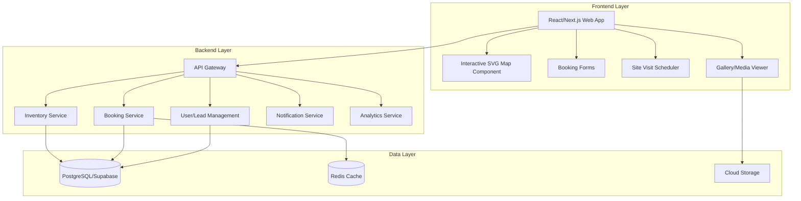
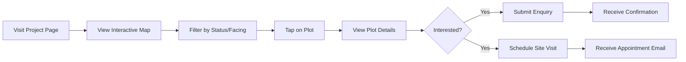
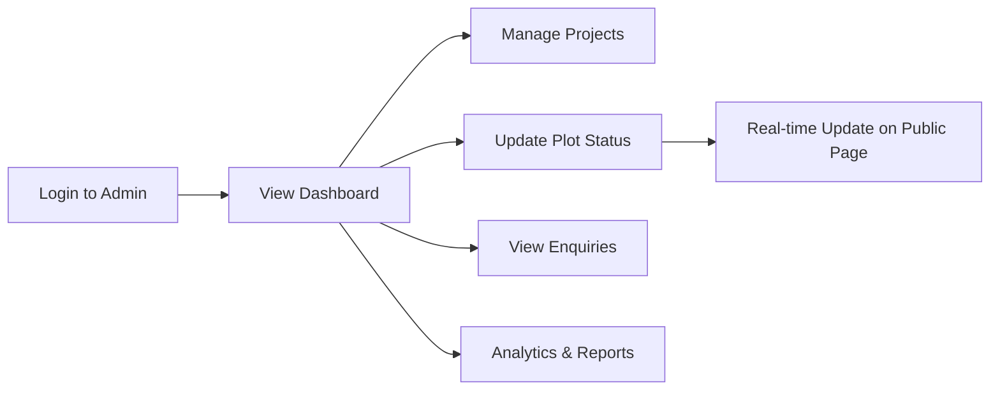

# Plot Availability System - Complete Research & Development Guide

## What is This?

The URL you shared ([https://sandbox.pgrinfrastructures.com/projects/plot-availability/11](https://sandbox.pgrinfrastructures.com/projects/plot-availability/11)) is a **Real Estate Plot Availability & Booking System** powered by **Blindersoe** - a PropTech (Property Technology) solution.

### Core Concept

This is an **Interactive Real-Time Plot/Apartment Inventory Management System** that enables:

1. **Visual Plot Layouts** - Interactive digital maps showing all plots in a real estate project
2. **Real-Time Availability** - Live status updates (Available, Booked, Hold, Sold)
3. **Enquiry Management** - Direct booking/enquiry forms for interested buyers
4. **Site Visit Scheduling** - Calendar-based appointment booking
5. **Multi-Channel Sharing** - Easy sharing of plot availability pages

---

## The Product Breakdown

### Key Features Identified from the URL

| Feature | Description |
|---------|-------------|
| **Interactive Layout Map** | Visual representation of plots that users can pan, zoom, and tap |
| **Plot Status Indicator** | Color-coded plots showing Available/Booked/Hold/Sold status |
| **Booking Enquiry Form** | Quick form to capture lead information |
| **Site Visit Scheduler** | Time slot booking for property visits |
| **Inventory Report** | Analytics and reporting dashboard |
| **Gallery/Media Section** | Project images and videos |
| **Location Map** | Google Maps integration for project location |
| **Share Functionality** | Social media and direct link sharing |
| **Mobile-Responsive** | Touch gestures (pinch-zoom, pan) support |

---

## System Architecture



---

## Recommended Tech Stack

### Frontend

| Technology | Purpose |
|------------|---------|
| **React 18+** / **Next.js 14+** | UI framework with SSR/SSG capabilities |
| **TypeScript** | Type safety and better DX |
| **Tailwind CSS** | Rapid styling with utility classes |
| **SVG + React** | Interactive plot maps |
| **Zustand** | Lightweight state management |
| **React Query / SWR** | Server state management & caching |
| **Framer Motion** | Smooth animations |
| **React Hook Form** | Form handling |
| **Zod** | Validation |

### Backend

| Technology | Purpose |
|------------|---------|
| **Supabase** | Database, Auth, Storage, Realtime (all-in-one) |
| **PostgreSQL** | Primary database |
| **Node.js / Express** or **tRPC** | API layer (optional with Supabase) |
| **Redis** | Caching for availability status |
| **Resend / SendGrid** | Email notifications |

### DevOps

| Technology | Purpose |
|------------|---------|
| **Vercel** | Frontend deployment |
| **Supabase Cloud** | Backend infrastructure |
| **GitHub Actions** | CI/CD |

---

## Database Schema Design

```sql
-- Projects Table
CREATE TABLE projects (
    id UUID PRIMARY KEY DEFAULT gen_random_uuid(),
    name VARCHAR(255) NOT NULL,
    slug VARCHAR(255) UNIQUE NOT NULL,
    description TEXT,
    location TEXT,
    builder_name VARCHAR(255),
    total_plots INTEGER,
    svg_layout_url TEXT,
    cover_image_url TEXT,
    google_maps_url TEXT,
    created_at TIMESTAMPTZ DEFAULT NOW(),
    updated_at TIMESTAMPTZ DEFAULT NOW()
);

-- Plots Table
CREATE TABLE plots (
    id UUID PRIMARY KEY DEFAULT gen_random_uuid(),
    project_id UUID REFERENCES projects(id) ON DELETE CASCADE,
    plot_number VARCHAR(50) NOT NULL,
    svg_element_id VARCHAR(100), -- ID in the SVG for this plot
    area_sqft DECIMAL(10,2),
    price DECIMAL(12,2),
    price_per_sqft DECIMAL(10,2),
    facing VARCHAR(50), -- North, South, East, West, Corner
    status VARCHAR(20) DEFAULT 'available', -- available, hold, booked, sold
    dimensions VARCHAR(100), -- e.g., "30x40"
    is_corner BOOLEAN DEFAULT FALSE,
    features JSONB,
    created_at TIMESTAMPTZ DEFAULT NOW(),
    updated_at TIMESTAMPTZ DEFAULT NOW()
);

-- Enquiries Table
CREATE TABLE enquiries (
    id UUID PRIMARY KEY DEFAULT gen_random_uuid(),
    project_id UUID REFERENCES projects(id),
    plot_id UUID REFERENCES plots(id),
    name VARCHAR(255) NOT NULL,
    email VARCHAR(255) NOT NULL,
    phone VARCHAR(20) NOT NULL,
    message TEXT,
    status VARCHAR(20) DEFAULT 'new', -- new, contacted, converted, closed
    created_at TIMESTAMPTZ DEFAULT NOW()
);

-- Site Visits Table
CREATE TABLE site_visits (
    id UUID PRIMARY KEY DEFAULT gen_random_uuid(),
    project_id UUID REFERENCES projects(id),
    enquiry_id UUID REFERENCES enquiries(id),
    name VARCHAR(255) NOT NULL,
    email VARCHAR(255) NOT NULL,
    phone VARCHAR(20) NOT NULL,
    scheduled_date DATE NOT NULL,
    time_slot VARCHAR(50) NOT NULL,
    status VARCHAR(20) DEFAULT 'scheduled', -- scheduled, completed, cancelled
    notes TEXT,
    created_at TIMESTAMPTZ DEFAULT NOW()
);

-- Project Gallery
CREATE TABLE project_gallery (
    id UUID PRIMARY KEY DEFAULT gen_random_uuid(),
    project_id UUID REFERENCES projects(id) ON DELETE CASCADE,
    media_type VARCHAR(20) DEFAULT 'image', -- image, video
    url TEXT NOT NULL,
    caption TEXT,
    display_order INTEGER DEFAULT 0,
    created_at TIMESTAMPTZ DEFAULT NOW()
);
```

---

## Component Architecture

### Core Components to Build

```
src/
├── components/
│   ├── layout/
│   │   ├── Header.tsx
│   │   ├── Footer.tsx
│   │   └── PageWrapper.tsx
│   │
│   ├── plot-map/
│   │   ├── InteractivePlotMap.tsx      # Main SVG map component
│   │   ├── PlotElement.tsx             # Individual plot in SVG
│   │   ├── PlotTooltip.tsx             # Hover details
│   │   ├── PlotDetailsModal.tsx        # Click details
│   │   ├── MapControls.tsx             # Zoom, pan, reset buttons
│   │   └── Legend.tsx                  # Status color legend
│   │
│   ├── forms/
│   │   ├── BookingEnquiryForm.tsx
│   │   ├── SiteVisitForm.tsx
│   │   └── ContactForm.tsx
│   │
│   ├── scheduling/
│   │   ├── TimeSlotPicker.tsx
│   │   ├── DatePicker.tsx
│   │   └── VisitConfirmation.tsx
│   │
│   ├── gallery/
│   │   ├── MediaGallery.tsx
│   │   └── LightboxViewer.tsx
│   │
│   └── shared/
│       ├── StatusBadge.tsx
│       ├── ShareButtons.tsx
│       └── LoadingSpinner.tsx
│
├── pages/ or app/
│   ├── projects/
│   │   ├── [slug]/
│   │   │   ├── page.tsx                # Main plot availability page
│   │   │   ├── gallery/page.tsx        # Project gallery
│   │   │   └── location/page.tsx       # Location map
│   │   └── page.tsx                    # All projects list
│   │
│   └── admin/
│       ├── dashboard/page.tsx
│       ├── projects/page.tsx
│       ├── plots/page.tsx
│       ├── enquiries/page.tsx
│       └── reports/page.tsx
│
├── hooks/
│   ├── usePlots.ts
│   ├── useProject.ts
│   └── useEnquiry.ts
│
├── lib/
│   ├── supabase.ts
│   └── utils.ts
│
└── types/
    ├── project.ts
    ├── plot.ts
    └── enquiry.ts
```

---

## Interactive SVG Map - The Core Feature

### How It Works

1. **Create SVG Layout** - Convert your plot layout drawing to SVG format
2. **Assign IDs** - Each plot element gets a unique `id` (e.g., `plot-A1`, `plot-B2`)
3. **Data Binding** - Match SVG IDs with database records
4. **Styling by Status** - Apply CSS classes based on plot status
5. **Interactivity** - Add click/hover handlers for each plot

### Example SVG Plot Map Component

```tsx
// components/plot-map/InteractivePlotMap.tsx
import { useState, useRef } from 'react';
import { motion } from 'framer-motion';
import type { Plot } from '@/types/plot';

interface PlotMapProps {
  svgContent: string;
  plots: Plot[];
  onPlotClick: (plot: Plot) => void;
}

export function InteractivePlotMap({ svgContent, plots, onPlotClick }: PlotMapProps) {
  const [scale, setScale] = useState(1);
  const [position, setPosition] = useState({ x: 0, y: 0 });
  const containerRef = useRef<HTMLDivElement>(null);

  // Apply status colors to SVG elements
  const enhancedSvg = useMemo(() => {
    let svg = svgContent;
    plots.forEach(plot => {
      const statusColor = getStatusColor(plot.status);
      svg = svg.replace(
        `id="${plot.svg_element_id}"`,
        `id="${plot.svg_element_id}" 
         class="plot-element cursor-pointer transition-all hover:opacity-80"
         fill="${statusColor}"
         data-plot-id="${plot.id}"`
      );
    });
    return svg;
  }, [svgContent, plots]);

  const handlePlotClick = (e: React.MouseEvent) => {
    const target = e.target as SVGElement;
    const plotId = target.closest('[data-plot-id]')?.getAttribute('data-plot-id');
    if (plotId) {
      const plot = plots.find(p => p.id === plotId);
      if (plot) onPlotClick(plot);
    }
  };

  return (
    <div 
      ref={containerRef}
      className="relative w-full h-[600px] overflow-hidden bg-gray-100 rounded-xl"
    >
      <motion.div
        drag
        dragConstraints={containerRef}
        style={{ scale, x: position.x, y: position.y }}
        onClick={handlePlotClick}
        dangerouslySetInnerHTML={{ __html: enhancedSvg }}
      />
      
      {/* Map Controls */}
      <div className="absolute bottom-4 right-4 flex gap-2">
        <button onClick={() => setScale(s => Math.min(s + 0.2, 3))}>+</button>
        <button onClick={() => setScale(s => Math.max(s - 0.2, 0.5))}>-</button>
        <button onClick={() => { setScale(1); setPosition({ x: 0, y: 0 }); }}>
          Reset
        </button>
      </div>
    </div>
  );
}

function getStatusColor(status: string): string {
  switch (status) {
    case 'available': return '#22c55e'; // green
    case 'hold': return '#f59e0b';      // amber
    case 'booked': return '#3b82f6';    // blue
    case 'sold': return '#ef4444';      // red
    default: return '#9ca3af';          // gray
  }
}
```

---

## Key User Flows

### 1. Customer Journey



### 2. Admin Journey



---

## Development Phases

### Phase 1: Foundation (Week 1-2)

- [ ] Set up Next.js project with TypeScript
- [ ] Configure Supabase (Database, Auth)
- [ ] Create database schema
- [ ] Build basic layout components
- [ ] Create project listing page

### Phase 2: Core Features (Week 3-4)

- [ ] Implement Interactive SVG Map component
- [ ] Build plot status management
- [ ] Create enquiry form with validation
- [ ] Implement site visit scheduling
- [ ] Add real-time status updates

### Phase 3: Admin Dashboard (Week 5-6)

- [ ] Build admin authentication
- [ ] Create project management CRUD
- [ ] Plot status update interface
- [ ] Enquiry management system
- [ ] Basic analytics dashboard

### Phase 4: Polish & Deploy (Week 7-8)

- [ ] Add animations and transitions
- [ ] Implement email notifications
- [ ] Mobile responsiveness
- [ ] Performance optimization
- [ ] Deploy to production

---

## Getting Started - Quick Setup

```bash
# 1. Create Next.js project
npx create-next-app@latest plot-availability --typescript --tailwind --app --src-dir

# 2. Install dependencies
cd plot-availability
npm install @supabase/supabase-js @supabase/auth-helpers-nextjs
npm install zustand react-hook-form @hookform/resolvers zod
npm install framer-motion lucide-react
npm install @radix-ui/react-dialog @radix-ui/react-popover

# 3. Set up Supabase
# Create project at supabase.com
# Copy credentials to .env.local

# 4. Run development server
npm run dev
```

---

## Summary

This **Plot Availability System** is a modern PropTech solution that helps real estate developers:

1. **Showcase** their project layouts visually
2. **Track** plot inventory in real-time
3. **Capture** leads through enquiry forms
4. **Schedule** site visits
5. **Analyze** sales and engagement data

The system combines **interactive SVG maps** with a **robust backend** to create a seamless experience for both buyers and sellers in the real estate market.

---

> **Ready to build this?** Let me know and we can start implementing each component step by step!
